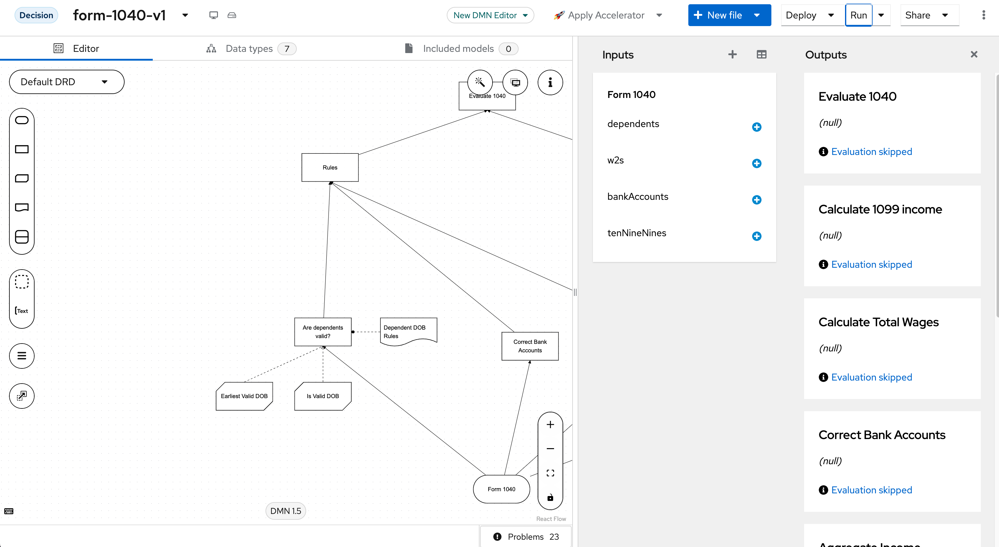

# IRS Validation/Perfection Prototype

A prototype system for validating different approaches for capturing rules and corrections to various IRS forms.

## Structure

The project consists of two main modules:

```
.
├── perfection-validation-engine/    # Core validation engine
│   ├── src/main/
│   │   ├── java/                   # Java source files
│   │   │   └── com/focus/irs/pv/   # Main application code
│   │   └── resources/              # Application resources and configurations
│   └── pom.xml                     # Module-specific Maven configuration
│
├── form-1040-rules/                # Form 1040 validation rules
│   ├── src/main/
│   │   ├── resources/
│   │   │   ├── rules/             # DMN rule definitions
│   │   │   └── META-INF/          # Drools configuration
│   │   └── java/                  # Java source files
│   └── pom.xml                    # Module-specific Maven configuration
│
├── compose.yaml                    # Docker compose configuration
└── pom.xml                        # Parent Maven configuration
```

## Environment Setup

### Prerequisites

1. Java Development Kit (JDK) 17 or later
2. Apache Maven 3.8+
3. Docker and Docker Compose (optional, for containerized deployment)

### Local Development Setup

1. Clone the repository:

   ```bash
   git clone [repository-url]
   cd irs-validation-perfection-prototype
   ```

2. Build the project:

   ```bash
   mvn clean install
   ```

<!-- AI! add an explanation that this brings up kafka locally and then runs the application -->

3. Run the application:

   ```bash
   # Start Kafka and Kafka UI in Docker containers
   docker compose -f 'compose.yaml' up -d --build 'kafka'
   docker compose -f 'compose.yaml' up -d --build 'kafka-ui' 
   
   # Run the Spring Boot application
   cd perfection-validation-engine
   mvn spring-boot:run
   ```

   This sequence first brings up Kafka and Kafka UI in Docker containers, then runs the Spring Boot application. The application connects to the local Kafka instance for message processing. You can access the Kafka UI at http://localhost:8081 to monitor topics and messages.

For more details on running the prototype and example API calls, see the [Perfection/Validation Engine README](./perfection-validation-engine/README.md#running-the-prototype).

### DMN File Editing

The DMN (Decision Model and Notation) files in this project can be viewed and edited using two methods:

#### 1. VSCode Kogito Extension

1. Install the "Kogito Bundle" extension in VSCode
2. Open any `.dmn` file in the project
3. The extension will provide a visual editor for the DMN file
4. Start the kie-extended-services using Docker Compose:

   ```bash
   docker compose up kie-extended-services
   ```


#### 2. Local KIE Webapp

1. Start both required services using Docker Compose:

   ```bash
   docker compose up kie-extended-services kie-webapp
   ```

2. Access the KIE Webapp at <http://localhost:8080>
3. Create a new project or open an existing one
4. Upload the DMN files from the `form-1040-rules/src/main/resources/rules/` directory
5. Use the web-based visual editor to view and modify the decision models



Note: Both methods require the kie-extended-services to be running for full functionality including validation and testing capabilities. The kie-extended-services runs on port 21345 and provides necessary backend services for DMN editing and validation.

### KIE Resources Registration

The project demonstrates a modular approach to business rules management through two separate components:

1. **form-1040-rules Project**:
   - This is a dedicated rules project that compiles into a KJAR (Knowledge JAR)
   - Contains all Form 1040-specific decision models and rules
   - Includes both DMN decision models and BPMN process definitions
   - Allows business processes and rules to be authored directly in this project
   - Follows the standard KIE project structure with kmodule.xml configuration
   - Enables independent versioning and deployment of business rules
   - Can be maintained by a separate team of business analysts or rule authors

2. **perfection-validation-engine**:
   - The main application that consumes and executes the rules
   - Loads the form-1040-rules KJAR as a Maven dependency
   - Provides the runtime environment and infrastructure

This separation of concerns reflects one approach to enterprise-level architecture where:

- Rules projects (KJARs) would typically reside in separate Git repositories
- Multiple teams can work independently on rules and application code
- Rules can be versioned, tested, and deployed without modifying the core application
- The same engine can load multiple rule packages for different forms or business domains

Note that a single repository containing all rules, processes, and framework code is also a valid approach, especially for smaller teams or projects. This unified approach can simplify development workflows and reduce complexity in deployment pipelines, while still maintaining logical separation between components.

The engine also demonstrates an alternative approach with rules stored directly in the application's resources directory, which may be suitable for simpler use cases.

## Troubleshooting

- Getting an error while running the spring boot application likely means that the form-1040-rules KJAR was not built and installed locally

## Troubleshooting

## Technology Stack

- **Java**: Core programming language
- **Spring Boot**: Application framework
- **Drools/DMN**: Business rules engine for Form 1040 validation rules
- **Maven**: Dependency management and build tool
- **Docker**: Containerization (optional)
