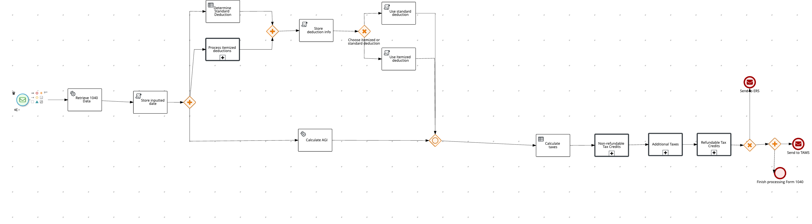
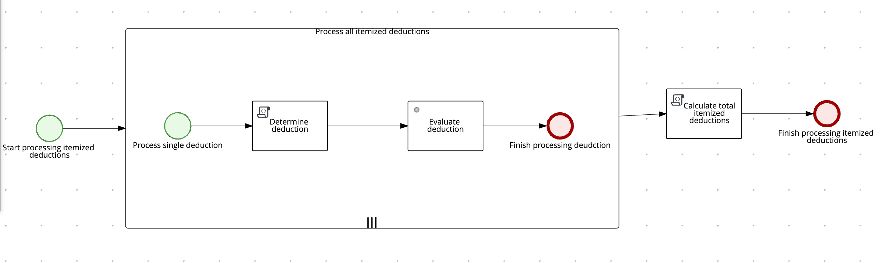
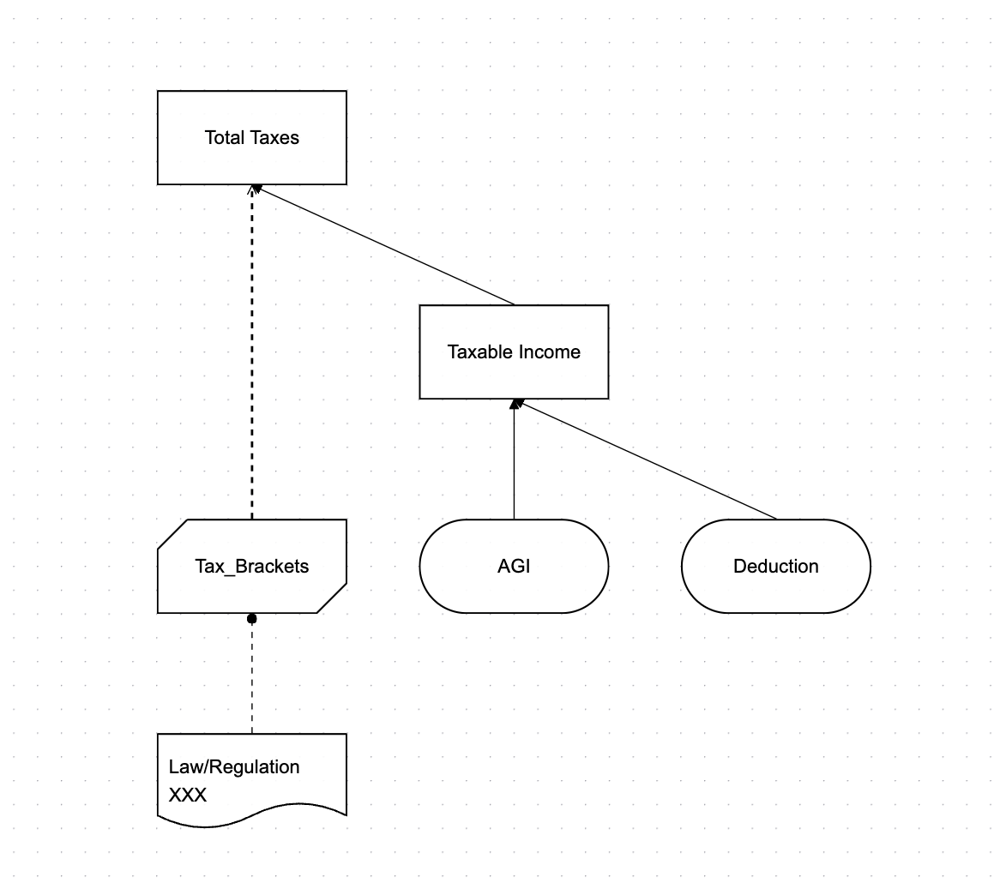
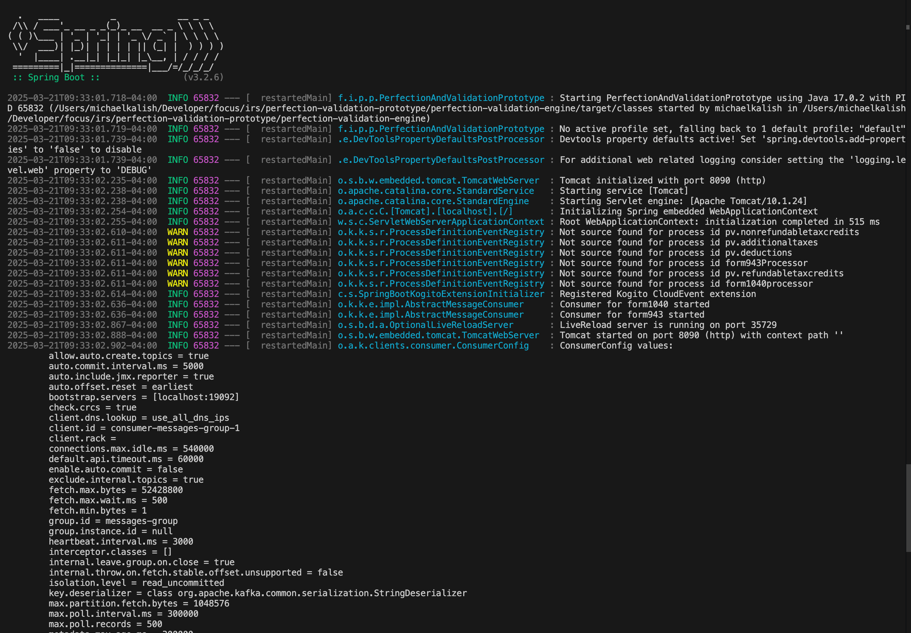
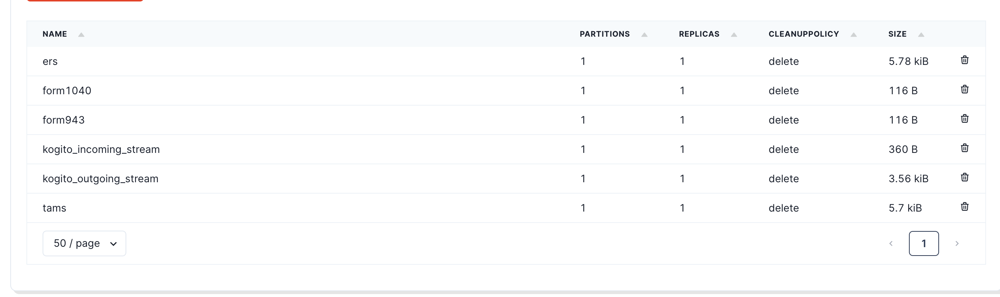
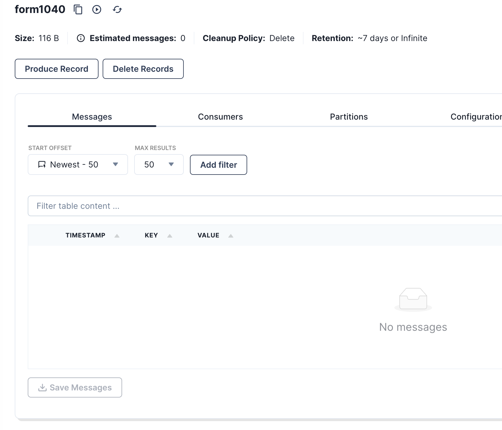
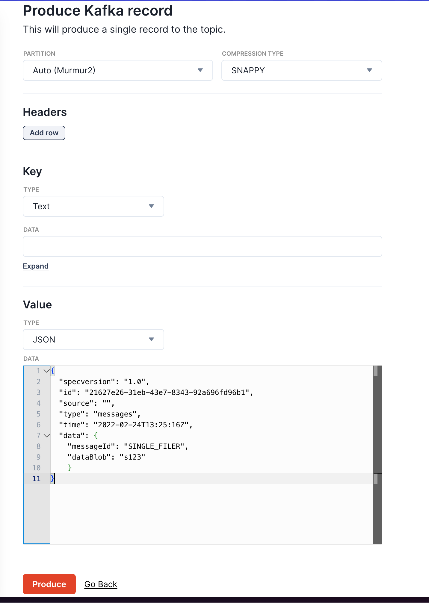
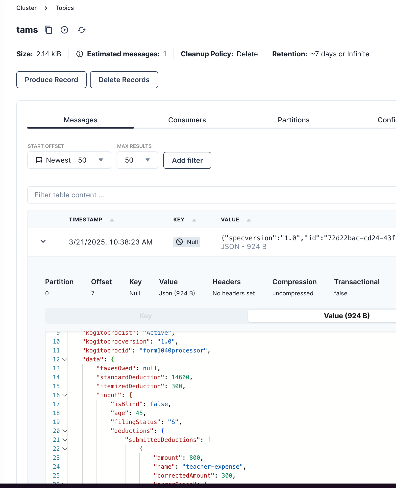

# Perfection/Validation Engine

This directory serves as the home for various prototypes focused on building decisions and processes for the Perfection/Validation Engine. These prototypes help explore and validate different approaches before implementing them in the production system.

## Implementation details

This prototype demonstrates the various technical capabilities of Apache KIE (Kogito, Drools, jBPM) in the context of IRS form processing. It showcases how business rules, decision models, and process workflows can be applied to tax form validation, perfection, and processing. The implementation illustrates:

- Decision Model and Notation (DMN) for tax calculation rules
- Business Process Model and Notation (BPMN) for form processing workflows
- Rule-based validation and correction of form data
- Integration with enterprise messaging systems
- Separation of business rules from application code
- Modular architecture for maintainability and scalability

### Kafka

The prototype leverages Apache KIE's seamless integration with Kafka message queues. The BPMN processes are configured to listen to specific Kafka topics, allowing for event-driven workflow execution. This integration enables:

- Asynchronous processing of tax form submissions
- Scalable handling of high-volume form processing
- Reliable message delivery with built-in retry mechanisms
- Decoupled architecture between form submission and processing components

The integration requires minimal configuration, as Apache KIE provides out-of-the-box connectors that map Kafka messages to process variables and automatically trigger process instances when messages arrive on the configured topics.

After processing is complete, the BPMN processes publish the results back to designated Kafka topics, creating a full event-driven cycle. This allows downstream systems to consume and further process the validation results without direct coupling to the validation engine.

### Form 1040 Process

This implementation is not intended to be an exhaustive representation of all Form 1040 rules and validations. Rather, it was designed to be sufficiently complex to effectively pressure test Apache KIE's capabilities in handling real-world tax processing scenarios. The implementation includes enough business logic complexity, data transformations, and decision points to evaluate how the platform performs with tax domain-specific challenges.

This is the entry point for the processing a 1040 and orchestrates the other pieces

The Form 1040 implementation includes several key components visualized below:







These diagrams represent a subset of the implemented processes and decisions in the system, focusing on the core tax calculation and validation logic.

### Form 943

The Form 943 implementation demonstrates the application of DMN decision models for agricultural employer tax processing:


The implementation includes several interconnected decision models:


## Running the prototype
<!-- TODO: explain the Kafka integration and how to test it -->

The prototype can be executed by running and starting the application:

`./mvnw spring-boot:run -f perfection-validation-engine/pom.xml`

If this is successful, you should see something like:



### Starting the process via a Kafka message

1. Go to http://localhost:8081/topics and you should see that the topics that are used are created

2. Click the 1040 topic

3. Create a new record with the following contents. (click produce record and change the type to JSON):

__Note: the `messageId` is used to indicate what sample data should be loaded by the fetch service__
```json
{
  "specversion": "1.0",
  "id": "21627e26-31eb-43e7-8343-92a696fd96b1",
  "source": "",
  "type": "form1040", 
  "time": "2025-04-21T13:25:16Z",
  "data": {
	  "messageId": "SINGLE_FILER",
    "dataBlob": "objectStorage://single_filer"
	}
}
```


4. Confirm that it worked, by checking the TAMS topic


### Running individual decisions

In addition to the main process flow, all nested processes and decisions can be directly invoked via REST API endpoints. This allows for testing individual components of the system without running the entire workflow, which is particularly useful during development and debugging.

This is an example of the how the decisions can only be independently invoked.

```sh
 curl -X POST 'http://localhost:8090/calculate-total-taxes' -H 'Content-Type: application/json' -d '{"AGI": 121000}'
 ```

### API Documentation

After starting the Spring Boot application, you can access the OpenAPI documentation at:

```
http://localhost:8090/v3/api-docs
```
